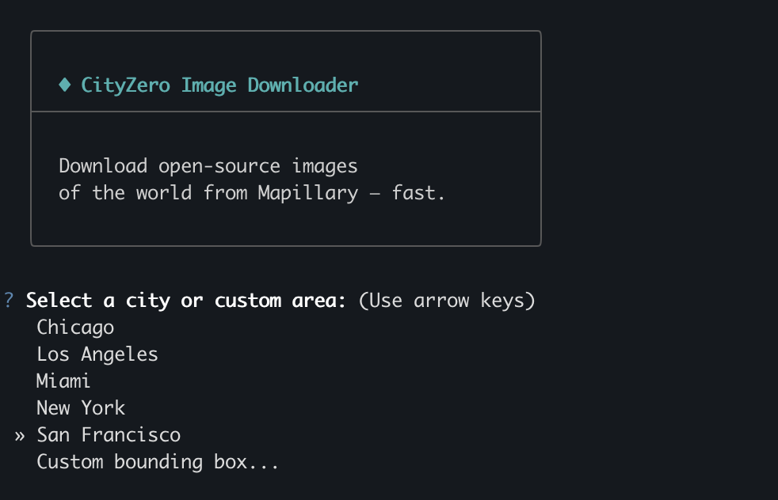

# cityzero



CLI tool to bulk-download street-level imagery from [Mapillary](https://www.mapillary.com/) at the biggest scales. Define a bounding box or pick a city and it discovers and downloads every available image in that area: upwards of 1–4 million images per major city, or 10–100k for individual neighbourhoods. GPS is embedded in EXIF, and downloads are resumable and fault-tolerant upon interruption thanks to a SQLite-based cache.

> This tool was spun off from [CityZero](https://github.com/SomeoneElseSt/CityZero/tree/master/mapillary), where its original commit history can be found.

## Install

```bash
pip install cityzero
```

## Setup

You'll need to get a client token from [mapillary.com/dashboard/developers](https://www.mapillary.com/dashboard/developers) and set it in your environment:

**macOS / Linux**

```bash
export MAPILLARY_CLIENT_TOKEN=MLY|...
```

**Windows CMD**

```bat
set "MAPILLARY_CLIENT_TOKEN=MLY|..."
```

## Usage

```bash
# Interactive mode — pick a city, then download
cityzero

# Specify a city directly
cityzero --city "San Francisco"

# Custom bounding box
cityzero --bbox "-122.52,37.70,-122.35,37.83"

# Limit images (useful for testing)
cityzero --city "New York" --limit 100

# Show available cities
cityzero --list-cities
```

## Options

| Option | Description |
|--------|-------------|
| `--city NAME` | Download from a predefined city |
| `--bbox W,S,E,N` | Custom bounding box |
| `--limit N` | Cap the number of images to download |
| `--output-dir PATH` | Output directory (default: `<city>` or `bbox#` in current directory) |
| `--preview` | Open an interactive map in the browser before downloading |
| `--state STATE` | Resume behaviour: `maintain` \| `merge` \| `rediscover` |
| `--granularity 1-100` | Discovery thoroughness (default: 25) |
| `--list-cities` | Show predefined cities and exit |

## Discovery states

When a previous run exists for a city:

| State | Behaviour |
|-------|-----------|
| `maintain` | Load from cache, skip API (default) |
| `merge` | Re-discover and add new images to existing cache |
| `rediscover` | Wipe cache and run a full fresh discovery |
